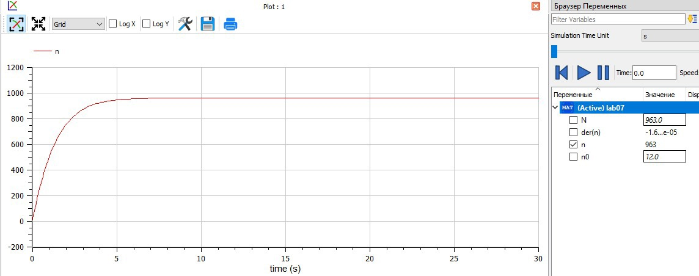
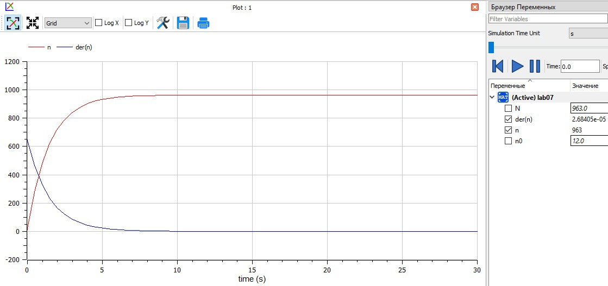
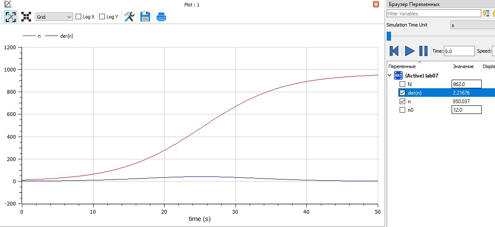
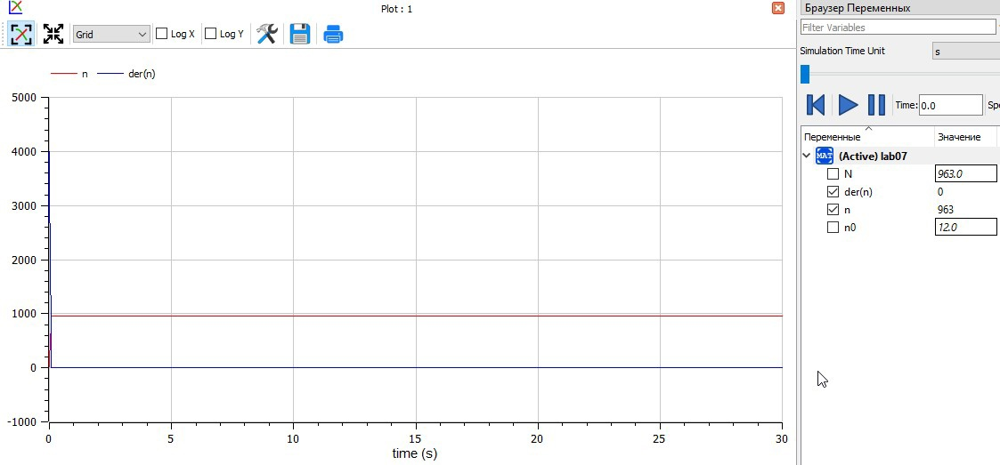
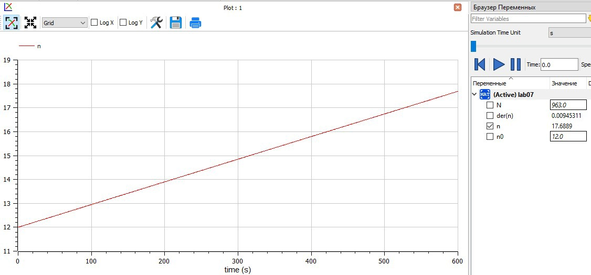
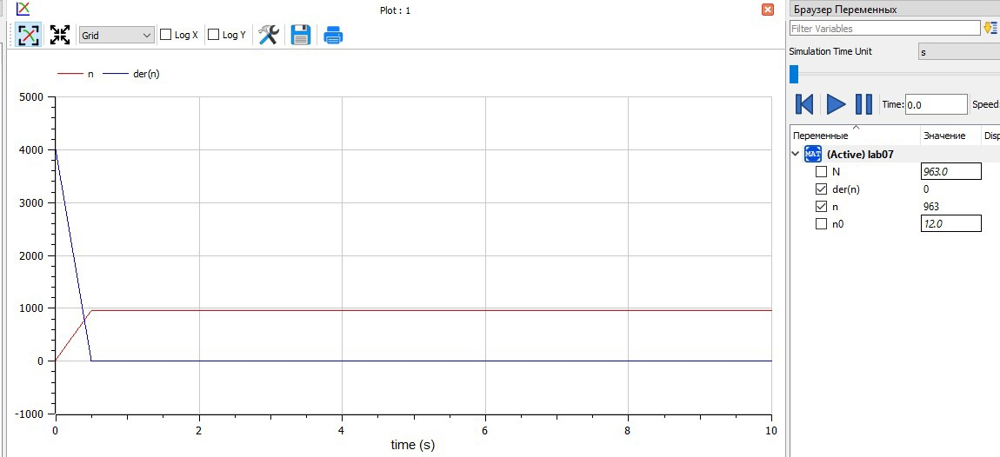
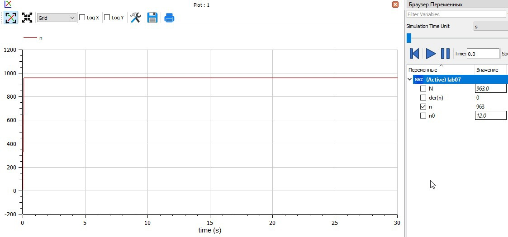

---
## Front matter
lang: ru-RU
title: "Лабораторная работа №7"
author: |
    Рыбалко Элина\inst{1}

institute: |
	\inst{1}RUDN University, Moscow, Russian Federation
  
date: 2022, 21 March, Murom, Russian Federation  

## Formatting
mainfont: PT Serif
romanfont: PT Serif
sansfont: PT Sans
monofont: PT Mono
toc: false
slide_level: 2
theme: metropolis
header-includes: 
 - \metroset{progressbar=frametitle,sectionpage=progressbar,numbering=fraction}
 - '\makeatletter'
 - '\beamer@ignorenonframefalse'
 - '\makeatother'
aspectratio: 43
section-titles: true
---

# Прагматика выполнения лабораторной работы 

 - Изучение основ математического моделирования.

 - Умение строить траектории движения в теории и визуализировать их.

# Цель выполнения лабораторной работы

  Рассмотреть модель распространения рекламы.

# Задачи выполнения лабораторной работы

  Задача: постройте график распространения рекламы, математическая модель которой описывается следующим уравнением:  
  1. $\frac{\partial n}{\partial t} = (0.68+0.00018n(t))(N-n(t))$  
  2. $\frac{\partial n}{\partial t} = (0.00001+0.35n(t))(N-n(t))$  
  3. $\frac{\partial n}{\partial t} = (0.51sin(5t)+0.31cos(3t)n(t))(N-n(t))$  
  
  При этом объем аудитории N = 963, в начальный момент о товаре знает 12 человек. Для случая 2 определите в какой момент времени скорость распространения рекламы будет иметь максимальное значение. 

# Результат выполнения лабораторной работы

  { #fig:001} 

# Результат выполнения лабораторной работы

  { #fig:002}

# Результат выполнения лабораторной работы

  { #fig:003}

# Результат выполнения лабораторной работы

  { #fig:004}

# Результат выполнения лабораторной работы

  { #fig:005}

# Результат выполнения лабораторной работы

  { #fig:006}

# Результат выполнения лабораторной работы

  { #fig:007} 

# Вывод

  Рассмотрели модель распространения рекламы.