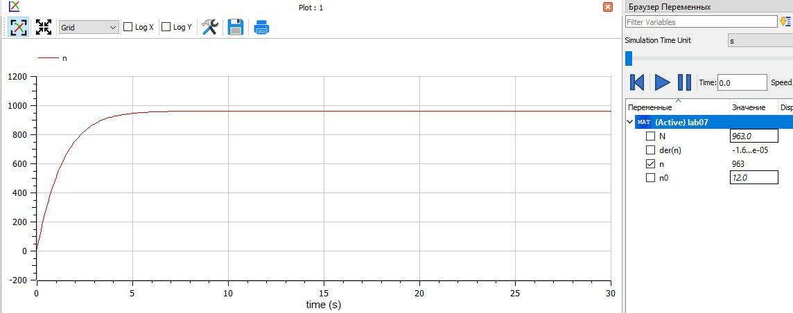
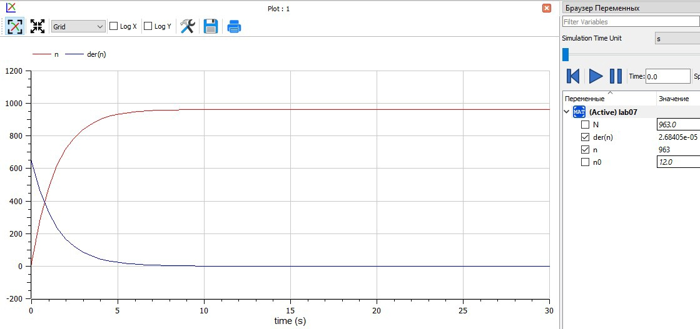
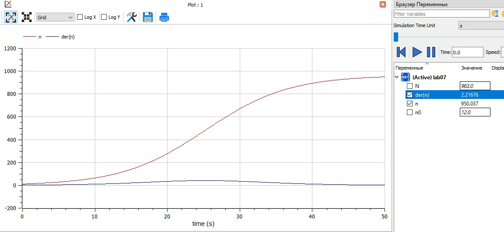
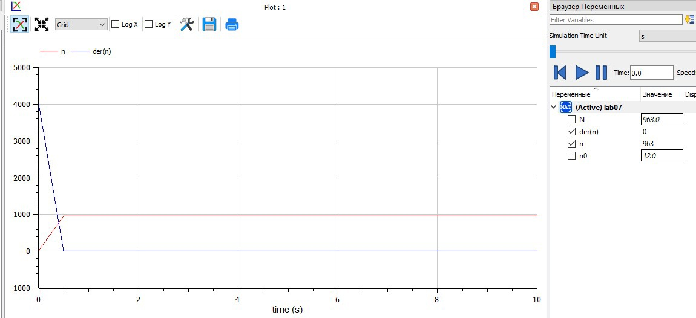
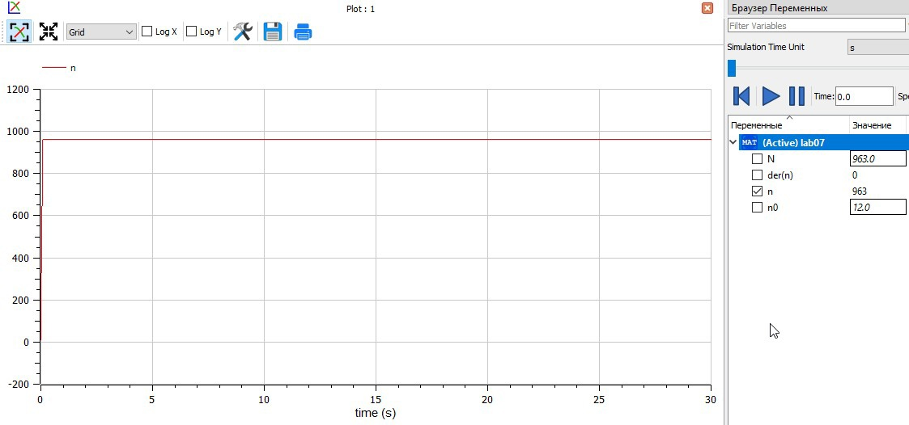

---
# Front matter
lang: ru-RU  
title: "Отчёт по лабораторной работе №7"  
subtitle: "дисциплина: Математическое моделирование"  
author: "Рыбалко Элина Павловна"  

# Generic otions
lang: ru-RU
toc-title: "Содержание"

# Bibliography
bibliography: bib/cite.bib
csl: pandoc/csl/gost-r-7-0-5-2008-numeric.csl

# Pdf output format
toc: true # Table of contents
toc_depth: 2
lof: true # List of figures
lot: true # List of tables
fontsize: 12pt
linestretch: 1.5
papersize: a4
documentclass: scrreprt
## I18n
polyglossia-lang:
  name: russian
  options:
  - spelling=modern
  - babelshorthands=true
polyglossia-otherlangs:
  name: english
### Fonts
mainfont: PT Serif
romanfont: PT Serif
sansfont: PT Sans
monofont: PT Mono
mainfontoptions: Ligatures=TeX
romanfontoptions: Ligatures=TeX
sansfontoptions: Ligatures=TeX,Scale=MatchLowercase
monofontoptions: Scale=MatchLowercase,Scale=0.9
## Biblatex
biblatex: true
biblio-style: "gost-numeric"
biblatexoptions:
  - parentracker=true
  - backend=biber
  - hyperref=auto
  - language=auto
  - autolang=other*
  - citestyle=gost-numeric
## Misc options
indent: true
header-includes:
  - \linepenalty=10 # the penalty added to the badness of each line within a paragraph (no associated penalty node) Increasing the value makes tex try to have fewer lines in the paragraph.
  - \interlinepenalty=0 # value of the penalty (node) added after each line of a paragraph.
  - \hyphenpenalty=50 # the penalty for line breaking at an automatically inserted hyphen
  - \exhyphenpenalty=50 # the penalty for line breaking at an explicit hyphen
  - \binoppenalty=700 # the penalty for breaking a line at a binary operator
  - \relpenalty=500 # the penalty for breaking a line at a relation
  - \clubpenalty=150 # extra penalty for breaking after first line of a paragraph
  - \widowpenalty=150 # extra penalty for breaking before last line of a paragraph
  - \displaywidowpenalty=50 # extra penalty for breaking before last line before a display math
  - \brokenpenalty=100 # extra penalty for page breaking after a hyphenated line
  - \predisplaypenalty=10000 # penalty for breaking before a display
  - \postdisplaypenalty=0 # penalty for breaking after a display
  - \floatingpenalty = 20000 # penalty for splitting an insertion (can only be split footnote in standard LaTeX)
  - \raggedbottom # or \flushbottom
  - \usepackage{float} # keep figures where there are in the text
  - \floatplacement{figure}{H} # keep figures where there are in the text
---

# Цель работы

  Рассмотреть модель распространения рекламы.  

## Объект исследования

  Модель распространения рекламы.

## Предмет исследования

  Алгоритм построения графика распространения рекламы.

# Теоретическое введение

  Организуется рекламная кампания нового товара или услуги. Необходимо, чтобы прибыль будущих продаж с избытком покрывала издержки на рекламу.
  Вначале расходы могут превышать прибыль, поскольку лишь малая часть потенциальных покупателей будет информирована о новинке. Затем, при увеличении числа продаж, возрастает и прибыль, и, наконец, наступит момент, когда рынок насытиться, и рекламировать товар станет бесполезным.  
  Предположим, что торговыми учреждениями реализуется некоторая продукция, о которой в момент времени t из числа потенциальных покупателей N знает лишь n покупателей. Для ускорения сбыта продукции запускается реклама по радио, телевидению и других средств массовой информации. После запуска рекламной кампании информация о продукции начнет распространяться среди потенциальных покупателей путем общения друг с другом. Таким образом, после запуска рекламных объявлений скорость изменения числа знающих о продукции людей пропорциональна как числу знающих о товаре покупателей, так и числу покупателей о нем не знающих.  
  Модель рекламной кампании описывается следующими величинами.
  Считаем, что $\frac{\partial n}{\partial t}$ - скорость изменения со временем числа потребителей, узнавших о товаре и готовых его купить, t - время, прошедшее с начала рекламной кампании, n(t) - число уже информированных клиентов. Эта величина пропорциональна числу покупателей, еще не знающих о нем, это описывается следующим образом: $a_{1}(t)(N-n(t))$, где N - общее число потенциальных платежеспособных покупателей, $a_{1}(t)>0$ - характеризует интенсивность рекламной кампании (зависит от затрат на рекламу в данный момент времени). Помимо этого, узнавшие о товаре потребители также распространяют полученную информацию среди потенциальных покупателей, не знающих о нем (в этом случае работает т.н. сарафанное радио). Этот вклад в рекламу описывается величиной $a_{2}(t)n(t)(N-n(t))$, эта величина увеличивается с увеличением потребителей узнавших о товаре. Математическая модель распространения рекламы описывается уравнением: $\frac{\partial n}{\partial t} = (a_1(t)+a_2(t)*n(t))(N-n(t))$  [[1]](#список-литературы) 

# Задание

  29 января в городе открылся новый салон красоты. Полагаем, что на момент открытия о салоне знали $N_0$ потенциальных клиентов. По маркетинговым исследованиям известно, что в районе проживают $N$ потенциальных клиентов салона. Поэтому после открытия салона руководитель запускает активную рекламную компанию. После этого скорость изменения числа знающих о салоне пропорциональна как числу знающих о нем, так и числу не знаю о нём.

  1. Построить график распространения рекламы о салоне красоты ( $N_0$ и $N$ - задайте самостоятельно).
  2. Сравнить эффективность рекламной кампании при $a_1(t) > a_2(t)$ и  $a_1(t) < a_2(t)$ 
  3. Определить в какой момент времени эффективность рекламы будет иметь максимально быстрый рост (на вашем примере).
  4. Построить решение, если учитывать вклад только платной рекламы.
  5. Построить решение, если предположить, что информация о товаре распространятся только путем «сарафанного радио», сравнить оба решения.


# Выполнение лабораторной работы

## 1. Постановка задачи

**[Вариант 22]**

  Задача: постройте график распространения рекламы, математическая модель которой описывается следующим уравнением:  
  1. $\frac{\partial n}{\partial t} = (0.68+0.00018n(t))(N-n(t))$  
  2. $\frac{\partial n}{\partial t} = (0.00001+0.35n(t))(N-n(t))$  
  3. $\frac{\partial n}{\partial t} = (0.51sin(5t)+0.31cos(3t)n(t))(N-n(t))$  
  
  При этом объем аудитории N = 963, в начальный момент о товаре знает 12 человек. Для случая 2 определите в какой момент времени скорость распространения рекламы будет иметь максимальное значение. 


## 2. Построение графиков 

### 2.1. Листинги программ в OpenModelica

  1. Написала программу на Modelica (с интервалом времени от 0 до 30 и шагом 0.1):

  Программа:

  ```
  model lab07
    parameter Real N=963; // максимальное количество людей, которых может заинтересовать товар
    parameter Real n0=12; // количество людей, знающих о товаре в начальный момент времени
    Real n(start=n0);
    function k
      input Real t;
      output Real res;
    algorithm
      res := 0.68; //1 случай
      //res := 0.00001; //2 случай
      //res := 0.51*sin(5*t); //3 случай
      //res := 0; //только платная реклама
    end k;

    function p
      input Real t;
      output Real res;
    algorithm
      res := 0.00018; //1 случай
      //res := 0.35; //2 случай
      //res := 0.31*cos(3*t); //3 случай
      //res := 0; //только сарафанное радио
    end p;
  equation
    der(n)=(k(time) + p(time)*n)*(N-n); 
  end lab07;
  ```

### 2.2. Полученный график  

  После запуска кода программы получили следующие графики для первого, второго случая и третьего случаев соответственно  (см. рис. -@fig:001, -@fig:002, -@fig:003, -@fig:004 -@fig:005, -@fig:006, -@fig:007).

  { #fig:001} 

  { #fig:002}

  { #fig:003}

  { #fig:004}

  { #fig:005}

  { #fig:006}

  { #fig:007} 


### 2.4. Анализ результатов:

  Как правило наибольшая эффективность рекламы на начальном моменте времени ($t = 0$), что можно заметить, например, из рис. -@fig:002. 
  Сравнивая первый и второй случаи ($a_1(t) > a_2(t)$ и  $a_1(t) < a_2(t)$) из рис. -@fig:001 и рис. -@fig:004 можно заметить, что прирост распространения информации происходит за меньшее время, чем в первом случае, что говорит о большей эффективности сарафанного радио в нашей задаче. 
  В зависимости от наших параметров по-разному будет эффективно использование только платной еркламы или только сарафанного радио. Если изначально $a_1(t) > a_2(t)$, то использование только платной рекламы будет значительно эффективнее (рис. -@fig:002), чем использование только сарафанного радио (рис. -@fig:003), и наоборот (рис. -@fig:005 и рис. -@fig:006) при $a_1(t) < a_2(t)$ соответственно.  

## 3. Выпросы к работе

  **1. Записать модель Мальтуса (дать пояснение, где используется данная модель)**

  $N_{i+1} = N_i + (r - m)*N_i$, где разность $(r - m)$ - это коэффициент прироста. Если он больше нуля (рождаемость выше смертности), то население растёт, если меньше - убывает. 
  Соответственно, используется для расчёта численности населения и демографического показателя.
  Или же в нашем случае $\frac{\partial n}{\partial t} = (a_1(t)+a_2(t)*n(t))(N-n(t))$, где $a_1(t) >> a_2(t)$.

  **2. Записать уравнение логистической кривой (дать пояснение, что описывает данное уравнение)**

   $\frac{\partial n}{\partial t} = (a_1(t)+a_2(t)*n(t))(N-n(t))$, где  $a_1(t) << a_2(t)$, $a_1$ -это интенсивность рекламной кампании, $a_2(t)*n(t))(N-n(t))$ - это вклад в рекламу (сарафанное радио).

   $\frac{\partial n}{\partial t}$ - скорость изменения со временем числа потребителей, узнавших о товаре и готовых его купить, t - время, прошедшее с начала рекламной кампании, n(t) - число уже информированных клиентов.

  **3. На что влияет коэффициент   $a_1(t)$ и $a_2(t)$ в модели распространения рекламы**

  $a_1$ -это интенсивность рекламной кампании, $a_2(t)*n(t))(N-n(t))$ - это вклад в рекламу (сарафанное радио).

  **4. Как ведёт себя рассматриваемая модель при $a_1(t) >> a_2(t)$**

  Получается модель типа модели Мальтуса (некая парабола).

  **5. Как ведёт себя рассматриваемая модель при $a_1(t) << a_2(t)$** 

  Получаем уравнение логистической кривой (некая гипербола).


# Вывод

  Рассмотрели модель распространения рекламы. 

# Список литературы {.unnumbered}

1. [Эффективность рекламы](https://docviewer.yandex.ru/view/289699604/?page=1&*=G1JKkJ2lYBeAnbTWWjkbWO7QKcF7InVybCI6Imh0dHBzOi8vc3R1ZC1zY2kucnVkbi5ydS9wbHVnaW5maWxlLnBocC8xNjg3Ni9tb2RfZm9sZGVyL2NvbnRlbnQvMC9wcm9qZWN0MDYucGRmP2ZvcmNlZG93bmxvYWQ9MSIsInRpdGxlIjoicHJvamVjdDA2LnBkZj9mb3JjZWRvd25sb2FkPTEiLCJub2lmcmFtZSI6dHJ1ZSwidWlkIjoiMjg5Njk5NjA0IiwidHMiOjE2NDc4NzkxMDY3OTksInl1IjoiNDM5NDc5NDA1MTU5NjE3ODEwNCIsInNlcnBQYXJhbXMiOiJ0bT0xNjQ3ODc5MTAxJnRsZD1ydSZsYW5nPXJ1Jm5hbWU9cHJvamVjdDA2LnBkZj9mb3JjZWRvd25sb2FkPTEmdGV4dD0lRDAlOUMlRDAlQkUlRDAlQjQlRDAlQjUlRDAlQkIlRDElOEMrJUQxJTgwJUQwJUI1JUQwJUJBJUQwJUJCJUQwJUIwJUQwJUJDJUQwJUJEJUQwJUJFJUQwJUI5KyVEMCVCQSVEMCVCMCVEMCVCQyVEMCVCRiVEMCVCMCVEMCVCRCVEMCVCOCVEMCVCOCslRDAlQkUlRDAlQkYlRDAlQjglRDElODElRDElOEIlRDAlQjIlRDAlQjAlRDAlQjUlRDElODIlRDElODElRDElOEYrJUQxJTgxJUQwJUJCJUQwJUI1JUQwJUI0JUQxJTgzJUQxJThFJUQxJTg5JUQwJUI4JUQwJUJDJUQwJUI4KyVEMCVCMiVEMCVCNSVEMCVCQiVEMCVCOCVEMSU4NyVEMCVCOCVEMCVCRCVEMCVCMCVEMCVCQyVEMCVCOC4rJUQwJUExJUQxJTg3JUQwJUI4JUQxJTgyJUQwJUIwJUQwJUI1JUQwJUJDJTJDKyVEMSU4NyVEMSU4MiVEMCVCRStkbitkdCstKyVEMSU4MSVEMCVCQSVEMCVCRSVEMSU4MCVEMCVCRSVEMSU4MSVEMSU4MiVEMSU4QyslRDAlQjglRDAlQjclRDAlQkMlRDAlQjUlRDAlQkQlRDAlQjUlRDAlQkQlRDAlQjglRDElOEYrJUQxJTgxJUQwJUJFKyVEMCVCMiVEMSU4MCVEMCVCNSVEMCVCQyVEMCVCNSVEMCVCRCVEMCVCNSVEMCVCQyslRDElODclRDAlQjglRDElODElRDAlQkIlRDAlQjArJUQwJUJGJUQwJUJFJUQxJTgyJUQxJTgwJUQwJUI1JUQwJUIxJUQwJUI4JUQxJTgyJUQwJUI1JUQwJUJCJUQwJUI1JUQwJUI5JTJDKyVEMSU4MyVEMCVCNyVEMCVCRCVEMCVCMCVEMCVCMiVEMSU4OCVEMCVCOCVEMSU4NSslRDAlQkUrJUQxJTgyJUQwJUJFJUQwJUIyJUQwJUIwJUQxJTgwJUQwJUI1KyVEMCVCOCslRDAlQjMlRDAlQkUlRDElODIlRDAlQkUlRDAlQjIlRDElOEIlRDElODUrJUQwJUI1JUQwJUIzJUQwJUJFKyVEMCVCQSVEMSU4MyVEMCVCRiVEMCVCOCVEMSU4MiVEMSU4QyUyQyt0Ky0rJUQwJUIyJUQxJTgwJUQwJUI1JUQwJUJDJUQxJThGJTJDKyVEMCVCRiVEMSU4MCVEMCVCRSVEMSU4OCVEMCVCNSVEMCVCNCVEMSU4OCVEMCVCNSVEMCVCNSslRDElODErJUQwJUJEJUQwJUIwJUQxJTg3JUQwJUIwJUQwJUJCJUQwJUIwKyVEMSU4MCVEMCVCNSVEMCVCQSVEMCVCQiVEMCVCMCVEMCVCQyVEMCVCRCVEMCVCRSVEMCVCOSslRDAlQkElRDAlQjAlRDAlQkMlRDAlQkYlRDAlQjAlRDAlQkQlRDAlQjglRDAlQjglMkMrbnQlMjgrJTI5Ky0rJUQxJTg3JUQwJUI4JUQxJTgxJUQwJUJCJUQwJUJFKyVEMSU4MyVEMCVCNiVEMCVCNSslRDAlQjglRDAlQkQlRDElODQlRDAlQkUlRDElODAlRDAlQkMlRDAlQjglRDElODAlRDAlQkUlRDAlQjIlRDAlQjAlRDAlQkQlRDAlQkQlRDElOEIlRDElODUrJUQwJUJBJUQwJUJCJUQwJUI4JUQwJUI1JUQwJUJEJUQxJTgyJUQwJUJFJUQwJUIyLislRDAlQUQlRDElODIlRDAlQjAmdXJsPWh0dHBzJTNBLy9zdHVkLXNjaS5ydWRuLnJ1L3BsdWdpbmZpbGUucGhwLzE2ODc2L21vZF9mb2xkZXIvY29udGVudC8wL3Byb2plY3QwNi5wZGYlM0Zmb3JjZWRvd25sb2FkJTNEMSZscj0xMDY2OCZtaW1lPXBkZiZsMTBuPXJ1JnNpZ249ZTAwODRhNDAxMzI0Y2Y2NDMzYWEyMmZmM2NmMmU3NjQma2V5bm89MCJ9&lang=ru)
2. [Руководство по формуле Cmd Markdown](https://russianblogs.com/article/26051452570/)
3. [Математическое моделирование при решении задач](https://urok.1sept.ru/articles/609795)
4. [С.В. Каштаева, Математическое моделирование / Учебное пособие](http://pgsha.ru:8008/books/study/%CA%E0%F8%F2%E0%E5%E2%E0%20%D1.%20%C2.%20%CC%E0%F2%E5%EC%E0%F2%E8%F7%E5%F1%EA%EE%E5%20%EC%EE%E4%E5%EB%E8%F0%EE%E2%E0%ED%E8%E5..pdf)
5. [Руководство по оформлению Markdown файлов](https://gist.github.com/Jekins/2bf2d0638163f1294637)